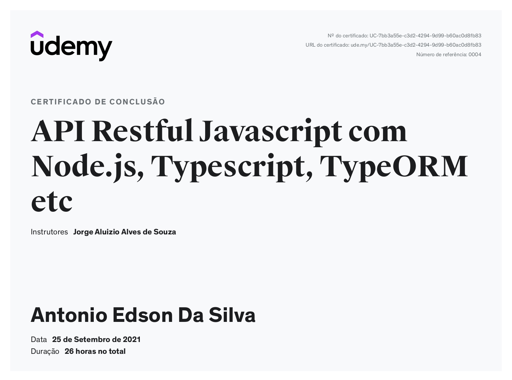

# API-Restful-Typescript
### Descrição :memo: :page_facing_up:
API Restful desenvolvida durante o curso [API Restful Javascript com Node.js, Typescript, TypeORM etc](https://www.udemy.com/course/api-restful-de-vendas/)
 

    

## 💻:iphone:Tecnologias utilizadas e conceitos aplicados

- `TypeScript`
- `aws-sdk` Aplicação utiliza o serviço S3 da AWS
- `postgresql` 
- `celebrate` Para validação dos dados
- `express`
- `jsonwebtoken` Para autenticação JWT
- `multer` Para upload de arquivos
- `redis` Para criação de cache da aplicação
- `nodemailer` Para envio de e-mail
---
